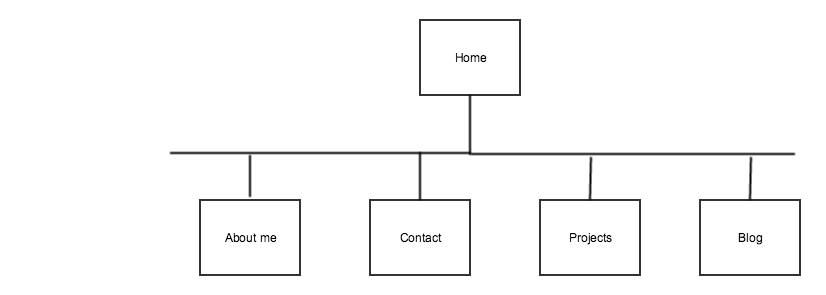

### Intro to Design and Site Planning Reflection

**What are the 6 Phases of Web Design?**

1. Information Gathering - This is where we figure out a purpose, goals and target audience of a site.
2. Planning - Develop a site map in the planning phase, which is a list of all main topic areas of the site, as well as sub-topics.
3. Design - Design the look and feel of your site.  The target audience of the site should have a big influence on the design.
4. Development - When the web site is created by writing the code.
5. Testing and Delivery - Testing the functionality of all the code and rewrite the code when necessary.
6. Maintenance - Keeping the site up to date.

**What is your site's primary goal or purpose? What kind of content will your site feature?**

The purpose of my site is to advertise myself.  The content on my site will be projects I have worked on so potential employers have a place to view it.

**What is your target audience's interests and how do you see your site addressing them?**

My target audience's interests would be the design, functionality, and content of the site.  I will want to emphasize my current knowledge of coding through my content and the interactiveness of my site.

**What is the primary "action" the user should take when coming to your site? Do you want them to search for information, contact you, or see your portfolio? It's ok to have several actions at once, or different actions for different kinds of visitors.**

I would want the user to search for information on my site.  I view my site in itself as part of my portfolio. I'd want to have a very inviting design on the home page and have it easy to naviagte. I'd like to have user impressed before they reach my portfolio.

**What are the main things someone should know about design and user experience?**

I think for someone who wants to make a website, they need to realize that the design for it needs to be for the user and not for themselves.  If the design doesn't have any UX in it then the users on the site will quickly leave and not return.  When designing, things to keep in mind are the color scheme, readability, and also consider what device your site is being viewed on.

**What is user experience design and why is it valuable?**

User expereince design is web designing focused on enhancing user satisfaction.  User experience is valuable because it keeps users engaged in a website and will help lead to reaching whatever the sites goal is, like selling a product.

**Which parts of the challenge did you find tedious?**

I didn't find any parts to be tedious.  Found it pretty interesting how important design is to the success of a website.
