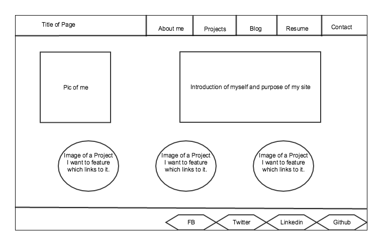
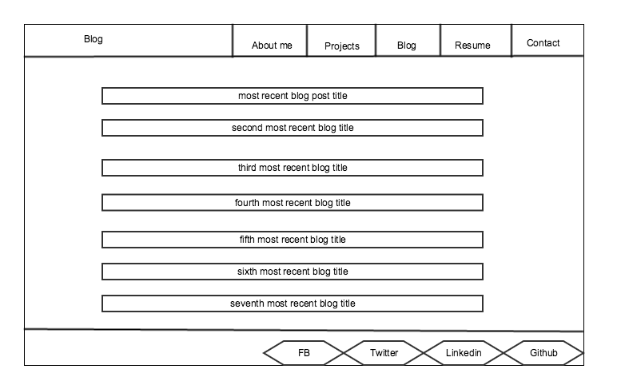

**What are the benefits of wire framing?**

A great benefit of wire framing is that it gives the developer a layout of how a page should look.  So the developer will be better prepared from the start when becomes time to start creating code for the page.

**Did you enjoy wireframing your site?**

It could have been more enjoyable.  I wasted a lot of time and putting too much thought into determining placements of certain elements.  I need to do a better job of just keeping it simple at this point.

**Did you revise your wireframe or stick with your first idea?**

All of the elements stayed the same, but just revised the placement of them.  My page is pretty simple so revisions weren’t really necessary.

**What questions did you ask during this challenge? What resources did you find to help you answer them?**

Since my hand-writing is terrible, I wanted to find a good free web application to help assist me in creating a wire-frame.  So I asked my brother, a graphic designer, and he had suggested Gliffy to me to use.  So far Gliffy has worked out and has covered all my needs for wire framing.

**Which parts of the challenge did you enjoy and which parts did you find tedious?**

At times I found making the wire frame on Gliffy could be tedious.  Just trying to get everything the right size.  I’m sure after more experience with Gliffy, it will become less tedious.  I did enjoy mapping out the site and visualizing how I want the site to look.