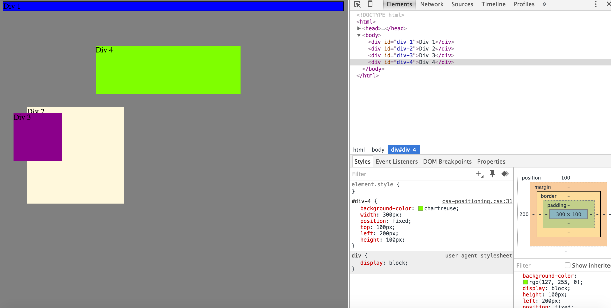
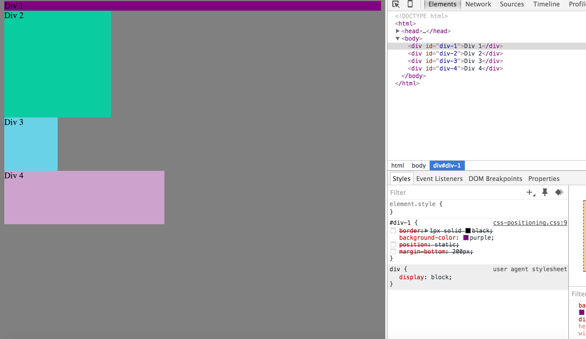
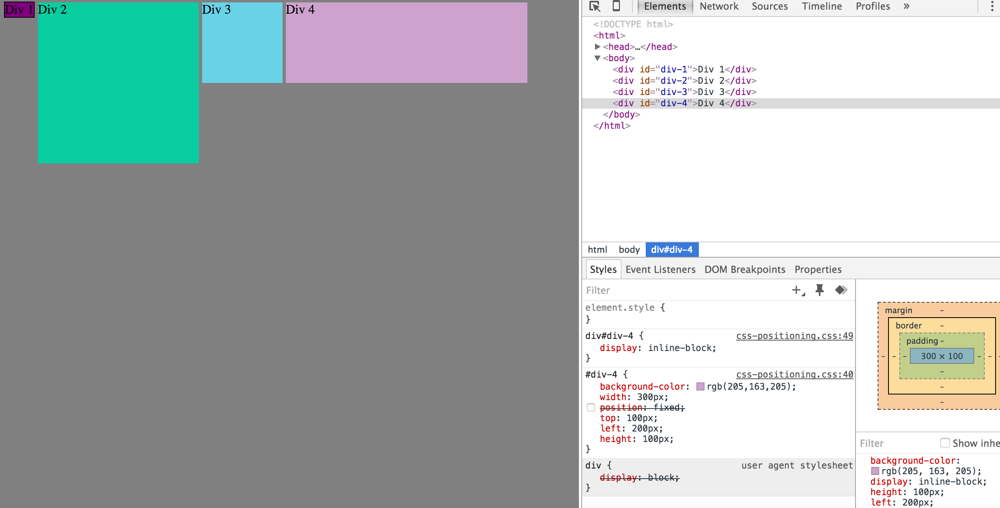
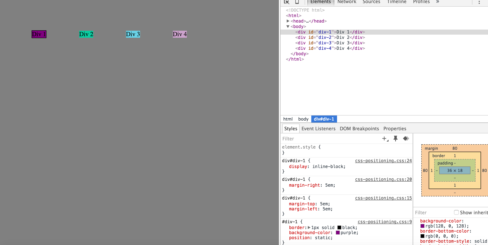
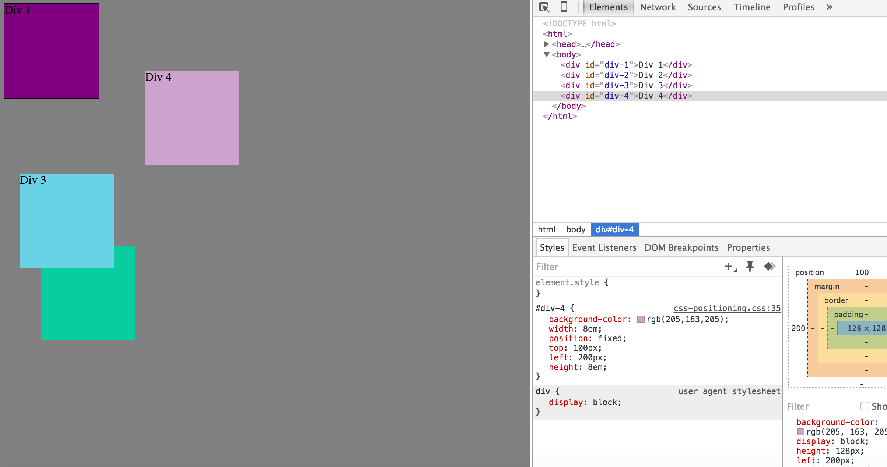
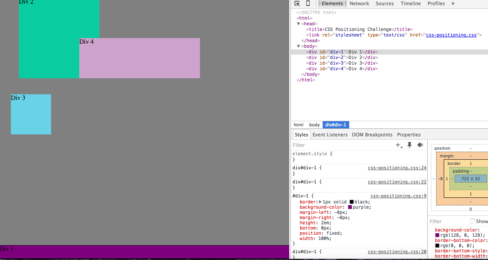
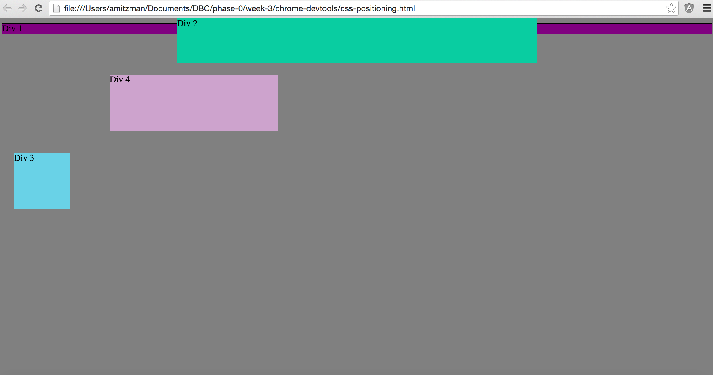
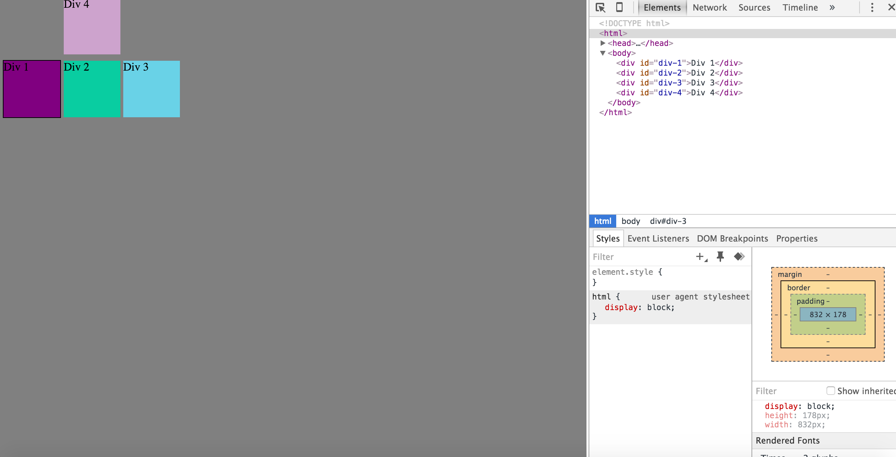

**How can you use Chrome's DevTools inspector to help you format or position elements?**

The DevTools shows you the current html and css of a website and allows you to change it.  So one can change the margin, position, border, padding, etc of an element and see a real time effect to it without altering the original file.  Can always just refresh the page to return the default.

**How can you resize elements on the DOM using CSS?**

Elements can be resized on the DOM by either altering or creating a width and height properties in CSS.  You can alter these properties by %, px or em.

**What are the differences between absolute, fixed, static, and relative positioning? Which did you find easiest to use? Which was most difficult?**

Static- is the default position.  Every position starts out as static and appears on the page as it normally would.

Absolute- The position of an absolute element is determined by the parent elements.  If there are no parents then its based off the body.

Fixed- an element that is fixed is independent of everything else on the page.  It  will always be positioned based on the browser window.  When the page is scrolled, the element stays fixed and is always visible.

Relative- When the position is relative, nothing will happen unless changes are made to the top, bottom, right or left property.

I thought the relative position was easiest for me to use.  I could actually move it around easier when just making changes to the top, bottom, right and left property.  Then absolute is the most difficult one for me as of now.  I could use some more practice with it.

**What are the differences between margin, border, and padding?**

Margin is the space outside and around the elements.  When altered, it effects how far the element is away from other elements.

Border is just the edge of an element.  Can create an outline of the element with a border.  It can be a full outline, just the right side, top, left, or bottom.

Padding is the spacing between the content and the border.  When altered, it effects how far the element’s content is from the border.

**What was your impression of this challenge overall? (love, hate, and why?)**

Started off pretty good, especially when all we had to do was change the colors.  Then became pretty frustrated when it came to positioning the elements.  There was a lot of trial and error done by us and some of the exercises took more time.  The header exercise gave us the most fits trying to get it centered.