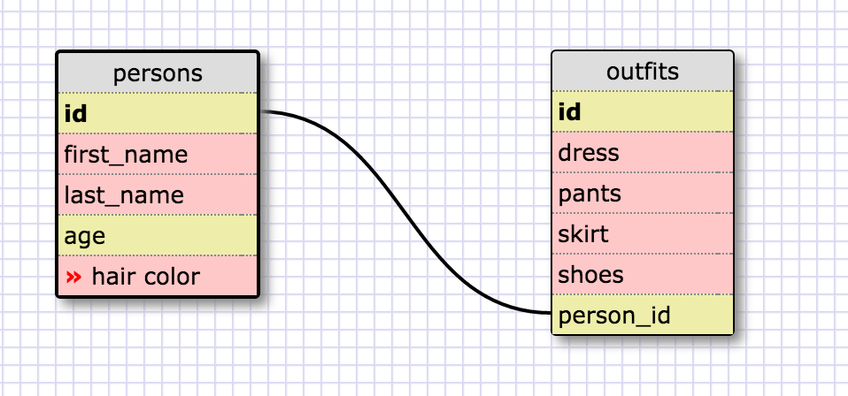

1. SELECT * FROM states;
2. SELECT * FROM regions;
3. SELECT state_name, population FROM states;
4. SELECT state_name, population FROM states ORDER BY population
5. SELECT state_name FROM states where region_id = 7;
6. SELECT state_name, population_density FROM states ORDER BY population_density ASC;
7. SELECT state_name FROM states WHERE population BETWEEN 1000000 and 1500000;
8. SELECT state_name, region_id FROM states ORDER BY region_id ASC;
9. SELECT region_name FROM regions WHERE region_name LIKE '%central%
10. SELECT region_name, state_name FROM states LEFT JOIN regions ON states.region_id = regions.id ORDER BY region_id;

**What are databases for?**

Databases are used to store large groups of information which are broken into to tables.  These tables then can be related to each other with identifiers and queries can be run to return certain data.

**What is a one-to-many relationship?**

One-to-many relationship is when a row in a table has a relationship with many rows in another table.  For example, one table called “people” and another called “shoes”.  “people” can own many types of “shoes” and this is way that they can be linked with a primary and foreign key.

**What is a primary key? What is a foreign key? How can you determine which is which?**

Primary key is a unique identifier and there can only be one value.  So if we had table full of people, the “name” key shouldn’t be the primary key since other people can have the same name.  It should be something like SSN which is unique to each person.

Foreign key is defined in a second table of the relationship, but it refers to the primary key in the first table.

**How can you select information out of a SQL database? What are some general guidelines for that?**

Use the SELECT command.  Then from there you can choose which rows and columns from a particular table you want.  Then you can add conditional statements for it and ways to have it ordered.  So we could select just the names of a movies from a table called ‘movies’  then we can sort them by alphabetical order.

