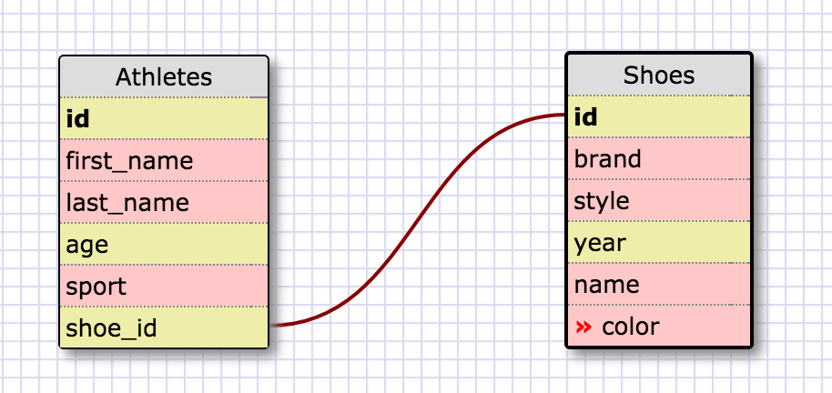
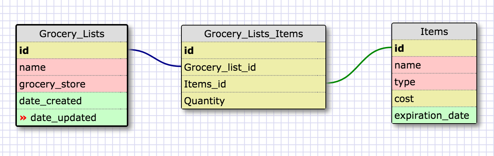

**What is a one-to-one database?**

One-to-one database is when two tables  have a single relationship to one another.  Usually share an id number.

**When would you use a one-to-one database? (Think generally, not in terms of the example you created).**

The rule of thumb is to use a one-to-one relationship when you have a relationship where a group of fields can all optionally be empty.

**What is a many-to-many database?**

Many to many is when many fields in one table can be linked to many fields in another table.  These are connected by a join table.

**When would you use a many-to-many database? (Think generally, not in terms of the example you created).**

This would be used when need to set up when fields in a table have multiple relationships with other table fields.

**What is confusing about database schemas? What makes sense?**

Just figuring out when to break a table up into to another to create a relationship.  Then just figuring out which is the foreign key and primary key.  When it’s all laid out and I can visually see it then it makes sense.